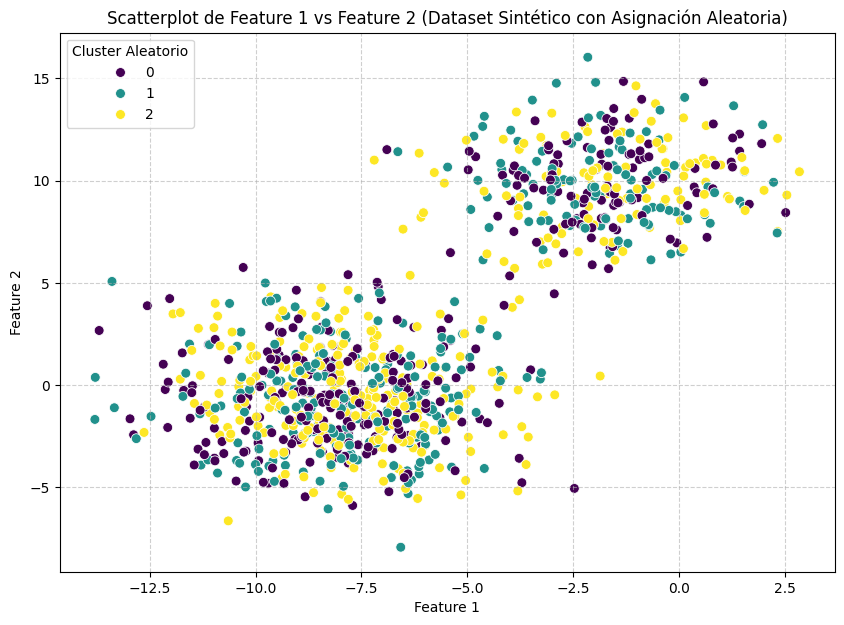

# Paso 2 — Asignación Aleatoria Inicial y Centroides

## ¿Por qué empezar de forma aleatoria?

K-Means necesita un punto de partida. Como no sabe a qué cluster pertenece cada observación, comienza asignando cada punto a un cluster **al azar**. Esta asignación inicial es mala a propósito: el algoritmo la irá corrigiendo iteración tras iteración hasta que converja.

En este paso simulamos ese estado inicial para entender qué tiene el algoritmo en sus manos antes de comenzar a optimizar.

---

## Asignar clusters aleatorios

```python
# Asignar aleatoriamente cada observación a uno de los 3 clusters
df['Cluster'] = np.random.randint(0, n_centers, n_samples)

print("Dataset con asignaciones aleatorias:")
display(df.head())
```

`np.random.randint(0, 3, 1000)` genera 1000 números enteros entre 0 y 2 (inclusive), uno por cada observación. Estos son los "clusters" iniciales, completamente inventados.

---

## Calcular los centroides iniciales

Con las asignaciones aleatorias ya hechas, calculamos el **centroide de cada cluster**: simplemente el promedio de las coordenadas de todos los puntos asignados a ese grupo.

```python
# El centroide de cada cluster es el promedio de sus puntos
centroids = df.groupby('Cluster')[['Feature 1', 'Feature 2']].mean().reset_index()

print("Centroides calculados:")
display(centroids)
```

El resultado es una tabla con 3 filas (una por cluster) y las coordenadas promedio de cada uno:

| Cluster | Feature 1 | Feature 2 |
|---------|-----------|-----------|
| 0 | -1.24 | 2.33 |
| 1 | 0.87 | -0.45 |
| 2 | 1.02 | 3.11 |

> Como la asignación fue aleatoria, estos centroides todavía **no reflejan la estructura real** de los datos. Eso cambiará en el siguiente paso.

---

## Visualización: scatter plot inicial

```python
plt.figure(figsize=(10, 7))
sns.scatterplot(
    x='Feature 1', y='Feature 2',
    data=df,
    hue='Cluster',
    palette='viridis',
    s=50
)
plt.title('Asignación Aleatoria de Clusters')
plt.xlabel('Feature 1')
plt.ylabel('Feature 2')
plt.grid(True, linestyle='--', alpha=0.6)
plt.legend(title='Cluster Aleatorio')
plt.show()
```


---

## Visualización: centroides sobre el scatter plot

```python
plt.figure(figsize=(10, 7))
sns.scatterplot(
    x='Feature 1', y='Feature 2',
    data=df,
    hue='Cluster',
    palette='viridis',
    s=50
)

# Los centroides se marcan con una X roja grande
plt.scatter(
    centroids['Feature 1'], centroids['Feature 2'],
    marker='X', s=200, color='red', edgecolor='black', label='Centroides'
)

plt.title('Asignación Aleatoria con Centroides')
plt.xlabel('Feature 1')
plt.ylabel('Feature 2')
plt.grid(True, linestyle='--', alpha=0.6)
plt.legend(title='Cluster/Tipo')
plt.show()
```


---

## Resumen de este paso

Al finalizar este paso tenemos:

1. ✅ 1000 puntos con asignación aleatoria de clusters (0, 1 o 2).
2. ✅ 3 centroides calculados como promedio de cada grupo aleatorio.
3. ✅ Una visualización que muestra el "caos" inicial.

El algoritmo ahora tiene todo lo que necesita para empezar a **iterar y mejorar** esas asignaciones, que es exactamente lo que veremos en el siguiente paso.

---

*← [Generación de datos](01_generacion_datos.md) | [Proceso iterativo →](03_proceso_iterativo.md)*
