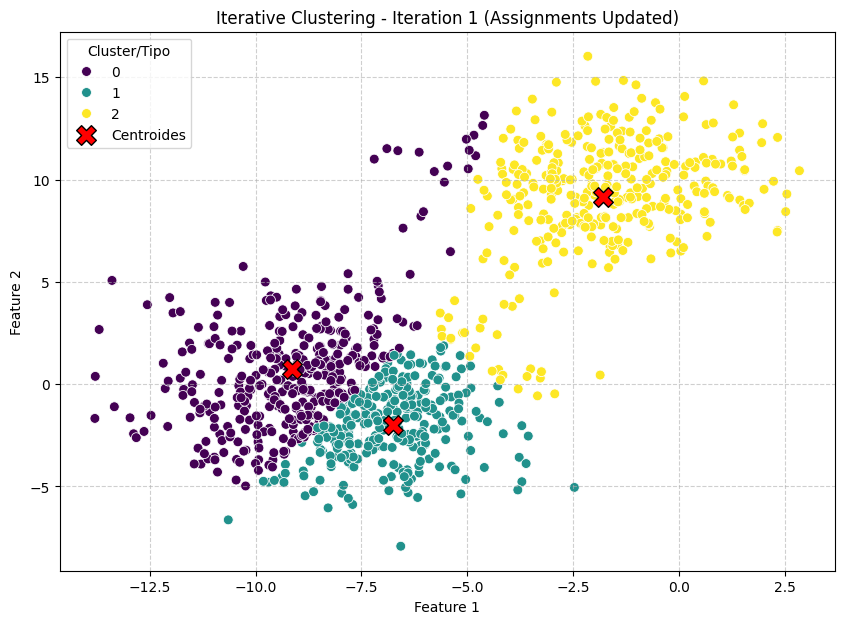
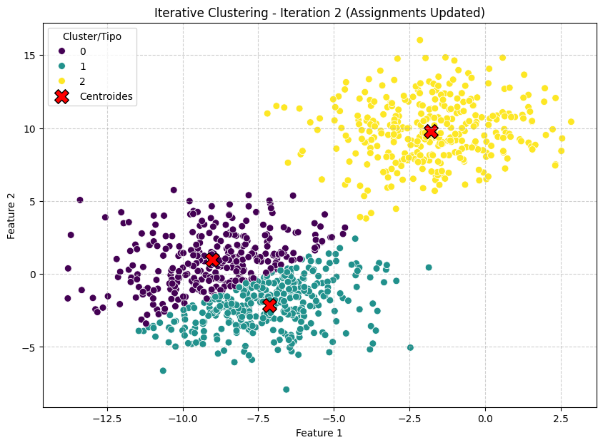
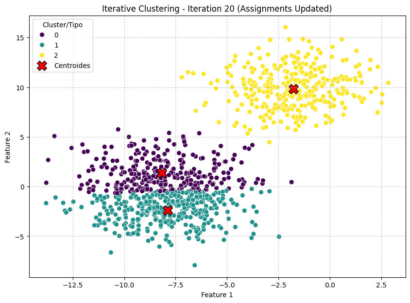

# Paso 3 — Proceso Iterativo: El Corazón de K-Means

## La lógica del algoritmo

K-Means funciona con un ciclo de dos pasos que se repite hasta que los clusters se estabilizan:

1. **Reasignar** cada punto al centroide más cercano.
2. **Recalcular** el centroide de cada cluster con sus nuevos miembros.

Cuando una iteración completa no produce ningún cambio en las asignaciones, el algoritmo **converge** y se detiene.

---

## El código completo

```python
from scipy.spatial.distance import cdist

# Copia del DataFrame para no modificar el original
df_iterative = df.copy()

converged = False
iteration = 0
prev_cluster_assignments = df_iterative['Cluster'].copy()

# Los centroides del paso anterior como array de NumPy
current_centroids = centroids[['Feature 1', 'Feature 2']].values

print("Iniciando proceso iterativo...")

while not converged:
    iteration += 1
    print(f"Iteración {iteration}:")

    # --- PASO 1: Calcular distancias y reasignar ---
    # cdist calcula la distancia euclídea de cada punto a cada centroide
    # Resultado: matriz de forma (1000, 3) — un valor por punto por centroide
    distances = cdist(
        df_iterative[['Feature 1', 'Feature 2']].values,
        current_centroids,
        metric='euclidean'
    )

    # Cada punto va al centroide más cercano (índice del mínimo en cada fila)
    new_cluster_assignments = np.argmin(distances, axis=1)

    # --- VERIFICAR CONVERGENCIA ---
    if np.array_equal(new_cluster_assignments, prev_cluster_assignments):
        converged = True
        print(f"Convergencia alcanzada después de {iteration - 1} iteraciones.")
        break

    df_iterative['Cluster'] = new_cluster_assignments

    # --- PASO 2: Recalcular centroides ---
    new_centroids = (
        df_iterative
        .groupby('Cluster')[['Feature 1', 'Feature 2']]
        .mean()
        .reset_index()
        .sort_values(by='Cluster')
        .reset_index(drop=True)
    )
    current_centroids = new_centroids[['Feature 1', 'Feature 2']].values

    # --- Graficar el estado de esta iteración ---
    plt.figure(figsize=(10, 7))
    sns.scatterplot(
        x='Feature 1', y='Feature 2',
        data=df_iterative,
        hue='Cluster', palette='viridis', s=50
    )
    plt.scatter(
        new_centroids['Feature 1'], new_centroids['Feature 2'],
        marker='X', s=200, color='red', edgecolor='black', label='Centroides'
    )
    plt.title(f'Iteración {iteration} — Asignaciones actualizadas')
    plt.xlabel('Feature 1')
    plt.ylabel('Feature 2')
    plt.grid(True, linestyle='--', alpha=0.6)
    plt.legend(title='Cluster/Tipo')
    plt.show()

    prev_cluster_assignments = new_cluster_assignments.copy()

print("Proceso finalizado.")
```

---

## ¿Qué hace `cdist`?

`cdist` de SciPy calcula la distancia entre dos conjuntos de puntos. Le pasamos:

- Las coordenadas de los 1000 puntos del dataset.
- Las coordenadas de los 3 centroides actuales.

Devuelve una **matriz de 1000 × 3** donde cada celda `[i, j]` es la distancia euclídea del punto `i` al centroide `j`.

```
            Centroide 0   Centroide 1   Centroide 2
Punto 0  [    4.21          1.03          6.87    ]
Punto 1  [    2.55          0.44          5.12    ]
...
```

Con `np.argmin(distances, axis=1)` tomamos el índice del centroide más cercano para cada fila: ese es el nuevo cluster de cada punto.

---

## Visualización por iteración

En cada iteración se genera un scatter plot. Lo interesante es ver cómo los colores van organizándose progresivamente:




```text
.
.
.
.
```



---

## Criterio de convergencia

El bucle termina cuando:

```python
np.array_equal(new_cluster_assignments, prev_cluster_assignments)
```

Es decir, cuando **ningún punto cambia de cluster** entre una iteración y la siguiente. En ese momento los centroides tampoco se moverían, así que el algoritmo ya no tiene nada más que optimizar.

> Con el dataset sintético de `make_blobs`, la convergencia suele ocurrir en **pocas iteraciones** (generalmente entre 3 y 10), porque los clusters están bien definidos. Con datos más complejos puede tomar más tiempo.

---

## Resumen del proceso K-Means (lo que acaba de pasar)

```
Estado inicial → Asignación aleatoria
        ↓
  [ Calcular distancias a centroides ]
        ↓
  [ Reasignar cada punto al más cercano ]
        ↓
  [ Recalcular centroides ]
        ↓
  ¿Cambió algo? → Sí → repetir
                → No → CONVERGENCIA ✓
```

Con esto concluye la parte conceptual del tutorial. En la segunda parte aplicaremos K-Means directamente (usando la implementación de scikit-learn) a un dataset real de expresión genética.

---

*← [Asignación aleatoria](02_asignacion_aleatoria.md) | [Carga del dataset NCI60 →](04_nci60_carga.md)*
