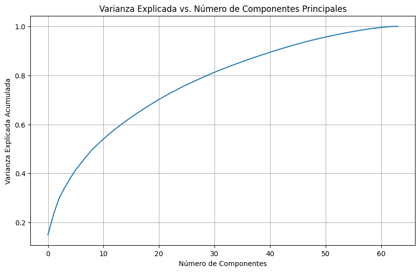

# Paso 5 — Reducción Dimensional con PCA

## ¿Por qué necesitamos PCA?

El dataset NCI60 tiene 6,830 genes (variables). Graficar datos en 6,830 dimensiones es imposible. PCA (Principal Component Analysis) nos permite **proyectar** esos datos a 2 o 3 dimensiones conservando la mayor cantidad posible de información.

Una componente principal es una **combinación lineal** de las variables originales, construida de forma que capture la mayor varianza de los datos. La primera PC captura la mayor varianza posible, la segunda la siguiente mayor varianza (siendo perpendicular a la primera), y así sucesivamente.

> **PCA no elimina genes arbitrariamente.** Construye nuevos ejes que resumen la información de todos los genes al mismo tiempo.

---

## PCA para visualización (2 componentes)

```python
from sklearn.decomposition import PCA

# Reducir a 2 componentes para poder graficar en 2D
pca = PCA(n_components=2)
X_nci60_pca = pca.fit_transform(X_nci60)

# Crear DataFrame con los componentes principales
df_nci60_pca = pd.DataFrame(
    X_nci60_pca,
    columns=['Principal Component 1', 'Principal Component 2']
)

print("Datos reducidos a 2 componentes principales:")
display(df_nci60_pca.head())
```

Después de este paso, cada una de las 64 líneas celulares tiene solo 2 valores: su posición en el espacio de las dos primeras componentes principales. Esto ya podemos graficarlo.

---

## PCA completo: ¿cuánta varianza capturamos?

Antes de decidir cuántas componentes usar, es útil ver cuánta información retiene cada una. Para eso, aplicamos PCA con todos los componentes posibles:

```python
# PCA con todos los componentes (n_components=None usa el máximo posible)
pca_full = PCA(n_components=None)
pca_full.fit(X_nci60)

# Varianza acumulada
plt.figure(figsize=(10, 6))
plt.plot(np.cumsum(pca_full.explained_variance_ratio_))
plt.xlabel('Número de Componentes')
plt.ylabel('Varianza Explicada Acumulada')
plt.title('Varianza Explicada vs. Número de Componentes Principales')
plt.grid(True)
plt.show()

# Valores concretos
print(f"Varianza explicada por los primeros  2 PCs: {np.cumsum(pca_full.explained_variance_ratio_)[1]:.2f}")
print(f"Varianza explicada por los primeros  3 PCs: {np.cumsum(pca_full.explained_variance_ratio_)[2]:.2f}")
print(f"Varianza explicada por los primeros  5 PCs: {np.cumsum(pca_full.explained_variance_ratio_)[4]:.2f}")
print(f"Varianza explicada por los primeros 10 PCs: {np.cumsum(pca_full.explained_variance_ratio_)[9]:.2f}")
```



---

## Varianza por componente individual

```python
plt.figure(figsize=(12, 6))
plt.bar(
    range(1, len(pca_full.explained_variance_ratio_) + 1),
    pca_full.explained_variance_ratio_
)
plt.xlabel('Número de Componente Principal')
plt.ylabel('Varianza Explicada')
plt.title('Varianza Explicada por Cada Componente Principal')
plt.grid(True, linestyle='--', alpha=0.6)
plt.show()

# Mostrar los primeros 10 valores
for i, ratio in enumerate(pca_full.explained_variance_ratio_[:10]):
    print(f"PC{i+1}: {ratio:.4f}")
```

- **imagen** — Gráfica de barras donde cada barra es una componente principal. Las primeras barras son las más altas (más varianza), y la gráfica cae rápidamente. Esto es un patrón esperado: en datos reales, pocas componentes concentran la mayor parte de la información.

---

## Interpretación

Los resultados típicos para NCI60 muestran algo así:

| Componentes | Varianza acumulada |
|-------------|-------------------|
| 2 | ~20% |
| 3 | ~30% |
| 5 | ~40% |
| 10 | ~55% |

¿Parece poco? Con 6,830 genes, concentrar el 28% de toda la varianza en solo 2 números es en realidad bastante. Para propósitos de **visualización**, PC1 y PC2 son suficientes. Para análisis más precisos se recomienda usar más componentes.

---

## Resumen de este paso

- PCA transforma los 6,830 genes en un conjunto reducido de componentes principales.
- Con 2 componentes podemos graficar y explorar la estructura de los datos.
- La gráfica de varianza acumulada nos ayuda a decidir cuántas componentes son suficientes para nuestro análisis.
- En el siguiente paso aplicaremos K-Means y usaremos PCA solo para la **visualización** de los resultados.

---

*← [Carga del NCI60](04_nci60_carga.md) | [K-Means sobre NCI60 →](06_kmeans_nci60.md)*
