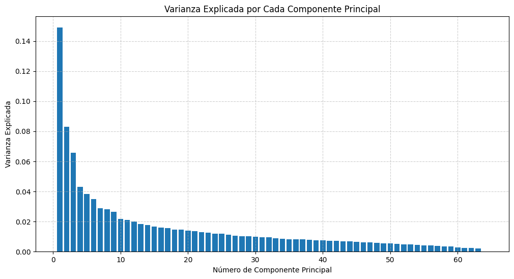
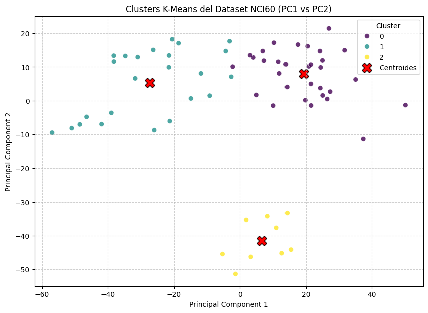
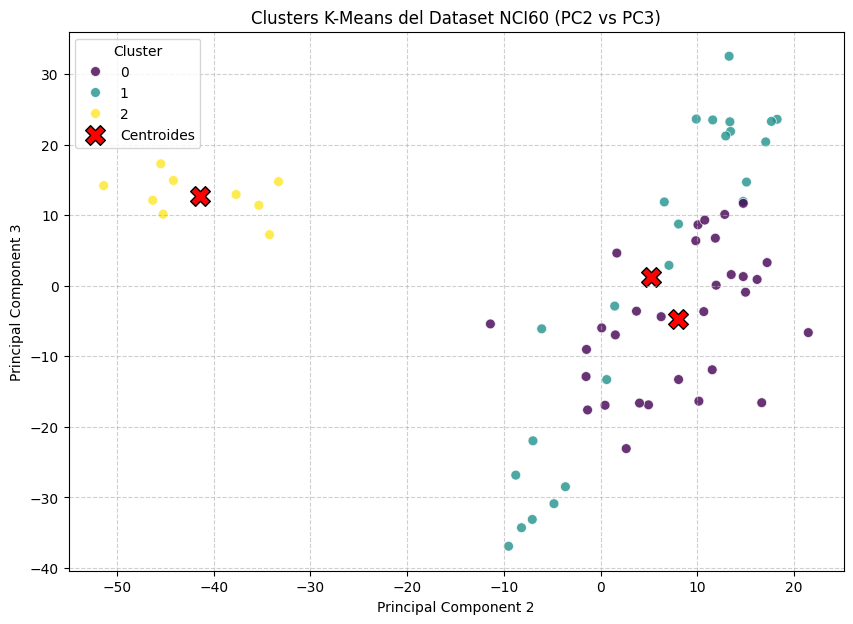

# Paso 6 — Aplicar K-Means al Dataset NCI60

## Estrategia: entrenar en alta dimensión, visualizar en 2D

Un punto importante que puede causar confusión:

- **K-Means se aplica sobre `X_nci60` original** → los 6,830 genes completos. El algoritmo ve toda la información disponible para calcular distancias y centroides.
- **PCA se usa solo para visualización** → reducimos a 2 dimensiones para poder hacer un scatter plot.

Si aplicáramos K-Means directamente sobre los 2 componentes de PCA, perderíamos el 72% de la información. Eso daría clusters de peor calidad.

---

## Aplicar K-Means con K=3

Como punto de partida, probamos con 3 clusters (un número razonable dado que hay más de 10 tipos de cáncer, pero es un buen primer intento).

```python
from sklearn.cluster import KMeans

# K-Means sobre los datos originales (6830 genes)
kmeans = KMeans(n_clusters=3, n_init=10, random_state=42)
kmeans.fit(X_nci60)

# Agregar las etiquetas de cluster al DataFrame de PCA para graficar
df_nci60_pca['Cluster_KMeans'] = kmeans.labels_

print("K-Means completado.")
display(df_nci60_pca.head())
```

**Parámetros importantes:**

| Parámetro | Valor | ¿Por qué? |
|-----------|-------|-----------|
| `n_clusters` | 3 | Número de grupos que queremos encontrar |
| `n_init` | 10 | Ejecuta K-Means 10 veces con inicializaciones distintas y elige el mejor resultado |
| `random_state` | 42 | Semilla para reproducibilidad: siempre obtendremos el mismo resultado |

> **¿Por qué `n_init=10`?** K-Means puede quedar atrapado en un mínimo local dependiendo de los centroides iniciales. Ejecutarlo múltiples veces y quedarse con el mejor resultado reduce ese riesgo.

---

## Proyectar los centroides al espacio PCA

Los centroides de K-Means existen en el espacio de 6,830 dimensiones. Para graficarlos junto con los datos, necesitamos proyectarlos al espacio de 2 PCs:

```python
# Los centroides en el espacio original (6830 dimensiones)
centroids_original_space = kmeans.cluster_centers_

# Proyectar al espacio PCA (2 dimensiones)
centroids_pca_space = pca.transform(centroids_original_space)
```

Usamos el mismo objeto `pca` que entrenamos en el paso anterior. `pca.transform()` aplica la misma proyección que aprendió sobre los datos originales.

---

## Visualización: PC1 vs PC2 con K=3

```python
plt.figure(figsize=(10, 7))
sns.scatterplot(
    x='Principal Component 1',
    y='Principal Component 2',
    data=df_nci60_pca,
    hue='Cluster_KMeans',
    palette='viridis',
    s=50, alpha=0.8
)

plt.scatter(
    centroids_pca_space[:, 0], centroids_pca_space[:, 1],
    marker='X', s=200, color='red', edgecolor='black', label='Centroides'
)

plt.title('Clusters K-Means del Dataset NCI60 (K=3, PC1 vs PC2)')
plt.xlabel('Principal Component 1')
plt.ylabel('Principal Component 2')
plt.grid(True, linestyle='--', alpha=0.6)
plt.legend(title='Cluster')
plt.show()
```



---

## Visualización con 3 componentes: más pares de PCs

Para una visión más completa, aplicamos PCA a 3 componentes y graficamos los tres pares posibles:

```python
# PCA con 3 componentes
pca_3 = PCA(n_components=3)
X_nci60_pca_3 = pca_3.fit_transform(X_nci60)

df_nci60_pca_3 = pd.DataFrame(
    X_nci60_pca_3,
    columns=['Principal Component 1', 'Principal Component 2', 'Principal Component 3']
)
df_nci60_pca_3['Cluster_KMeans'] = kmeans.labels_

# Centroides proyectados a 3 PCs
centroids_pca_space_3 = pca_3.transform(kmeans.cluster_centers_)
```

### PC1 vs PC2

```python
plt.figure(figsize=(10, 7))
sns.scatterplot(x='Principal Component 1', y='Principal Component 2',
                data=df_nci60_pca_3, hue='Cluster_KMeans', palette='viridis', s=50, alpha=0.8)
plt.scatter(centroids_pca_space_3[:, 0], centroids_pca_space_3[:, 1],
            marker='X', s=200, color='red', edgecolor='black', label='Centroides')
plt.title('Clusters K-Means NCI60 — PC1 vs PC2')
plt.grid(True, linestyle='--', alpha=0.6)
plt.legend(title='Cluster')
plt.show()
```



### PC1 vs PC3

```python
plt.figure(figsize=(10, 7))
sns.scatterplot(x='Principal Component 1', y='Principal Component 3',
                data=df_nci60_pca_3, hue='Cluster_KMeans', palette='viridis', s=50, alpha=0.8)
plt.scatter(centroids_pca_space_3[:, 0], centroids_pca_space_3[:, 2],
            marker='X', s=200, color='red', edgecolor='black', label='Centroides')
plt.title('Clusters K-Means NCI60 — PC1 vs PC3')
plt.grid(True, linestyle='--', alpha=0.6)
plt.legend(title='Cluster')
plt.show()
```



### PC2 vs PC3

```python
plt.figure(figsize=(10, 7))
sns.scatterplot(x='Principal Component 2', y='Principal Component 3',
                data=df_nci60_pca_3, hue='Cluster_KMeans', palette='viridis', s=50, alpha=0.8)
plt.scatter(centroids_pca_space_3[:, 1], centroids_pca_space_3[:, 2],
            marker='X', s=200, color='red', edgecolor='black', label='Centroides')
plt.title('Clusters K-Means NCI60 — PC2 vs PC3')
plt.grid(True, linestyle='--', alpha=0.6)
plt.legend(title='Cluster')
plt.show()
```


---

## Observaciones

Al ver los tres pares de PCs se pueden hacer las siguientes observaciones:

- En **PC1 vs PC2** suele verse la separación más clara, ya que estas dos componentes concentran la mayor varianza.
- En **PC1 vs PC3** y **PC2 vs PC3** la separación puede ser menos obvia, pero revelan estructura adicional.
- Con K=3, los clusters son bastante amplios. En el siguiente paso evaluaremos si un mayor número de clusters (como K=7) describe mejor los datos.

---

*← [Reducción dimensional con PCA](05_pca.md) | [K óptimo: Elbow & Silhouette →](07_k_optimo.md)*
