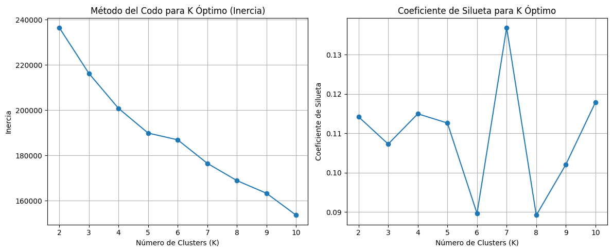

# Paso 7 — ¿Cuántos Clusters? Método del Codo y Coeficiente de Silueta

## El problema de elegir K

K-Means requiere que le digamos de antemano cuántos clusters queremos. Pero en la práctica, eso no siempre es obvio. Para el NCI60 hay 14 tipos de cáncer conocidos, pero algunos tienen muy pocas muestras y podrían agruparse juntos.

Existen dos métricas clásicas para guiar esta decisión:

1. **Inercia (Método del Codo):** qué tan compactos son los clusters.
2. **Coeficiente de Silueta:** qué tan bien separado está cada punto de los clusters vecinos.

---

## El código

```python
from sklearn.cluster import KMeans
from sklearn.metrics import silhouette_score
import matplotlib.pyplot as plt
import numpy as np

inertia = []
silhouette_scores = []
K_range = range(2, 11)  # Probar K desde 2 hasta 10

for k in K_range:
    kmeans_k = KMeans(n_clusters=k, n_init=10, random_state=42)
    kmeans_k.fit(X_nci60)
    
    inertia.append(kmeans_k.inertia_)
    
    # Silhouette necesita al menos 2 clusters distintos
    if len(np.unique(kmeans_k.labels_)) > 1:
        silhouette_scores.append(silhouette_score(X_nci60, kmeans_k.labels_))
    else:
        silhouette_scores.append(0)

# --- Graficar ---
plt.figure(figsize=(12, 5))

# Inercia
plt.subplot(1, 2, 1)
plt.plot(K_range, inertia, marker='o')
plt.xlabel('Número de Clusters (K)')
plt.ylabel('Inercia')
plt.title('Método del Codo')
plt.grid(True)

# Silueta
plt.subplot(1, 2, 2)
plt.plot(K_range, silhouette_scores, marker='o')
plt.xlabel('Número de Clusters (K)')
plt.ylabel('Coeficiente de Silueta')
plt.title('Coeficiente de Silueta')
plt.grid(True)

plt.tight_layout()
plt.show()

print("Inercia por K:", inertia)
print("Silueta por K:", silhouette_scores)
```



---

## Método del Codo (Inercia)

La **inercia** mide la suma de las distancias cuadradas de cada punto a su centroide. A más clusters, la inercia siempre baja (con K=64 cada punto sería su propio cluster y la inercia sería 0). Lo que buscamos es el punto donde la reducción de inercia empieza a ser marginal: el **codo** de la curva.

```
K=2  → inercia muy alta (clusters grandes)
K=3  → baja bastante
K=4  → baja algo menos
...
K=7  → la reducción ya no es tan significativa ← posible codo
K=8  → baja muy poco
```

> El codo no siempre es obvio. En datos reales, la curva a veces es bastante suave sin un punto de inflexión claro.

---

## Coeficiente de Silueta

El coeficiente de silueta de un punto `i` se define como:

```
s(i) = (b - a) / max(a, b)
```

Donde:
- **a** = distancia promedio de `i` a los demás puntos de su propio cluster.
- **b** = distancia promedio de `i` al cluster vecino más cercano (el cluster al que no pertenece pero que tiene menor distancia promedio).

El valor está entre **-1 y 1**:

| Valor | Interpretación |
|-------|---------------|
| Cercano a 1 | El punto está bien dentro de su cluster y lejos de los demás |
| Cercano a 0 | El punto está en la frontera entre dos clusters |
| Negativo | El punto probablemente fue asignado al cluster equivocado |

El score reportado es el **promedio de todos los puntos**. Buscamos el K que maximiza este promedio.

---

## Resultado: K=7 como valor óptimo

En nuestros experimentos con NCI60, **K=7** mostró el coeficiente de silueta más alto. Esto sugiere que 7 clusters describen mejor la estructura de los datos que 3 o 14.

Es interesante notar que:
- El dataset tiene 14 tipos de cáncer conocidos.
- K=7 agrupa algunos tipos que podrían tener perfiles de expresión similares.
- Esto tiene sentido biológico: cánceres de tejidos relacionados pueden compartir patrones de expresión genética.

---

## Resumen

| Método | Lo que mide | Lo que buscas |
|--------|-------------|---------------|
| Método del Codo | Compacidad interna de clusters | El "codo" en la curva de inercia |
| Coeficiente de Silueta | Separación entre clusters | El K con el mayor score |

Ambos métodos son complementarios. Cuando coinciden en un valor de K, hay más confianza en esa elección.

---

*← [K-Means sobre NCI60](06_kmeans_nci60.md) | [K=7 y Heatmap de genes →](08_kmeans_k7_heatmap.md)*
