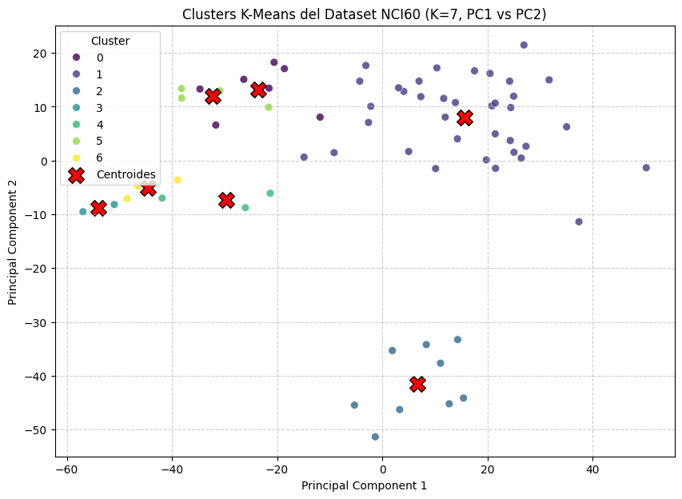
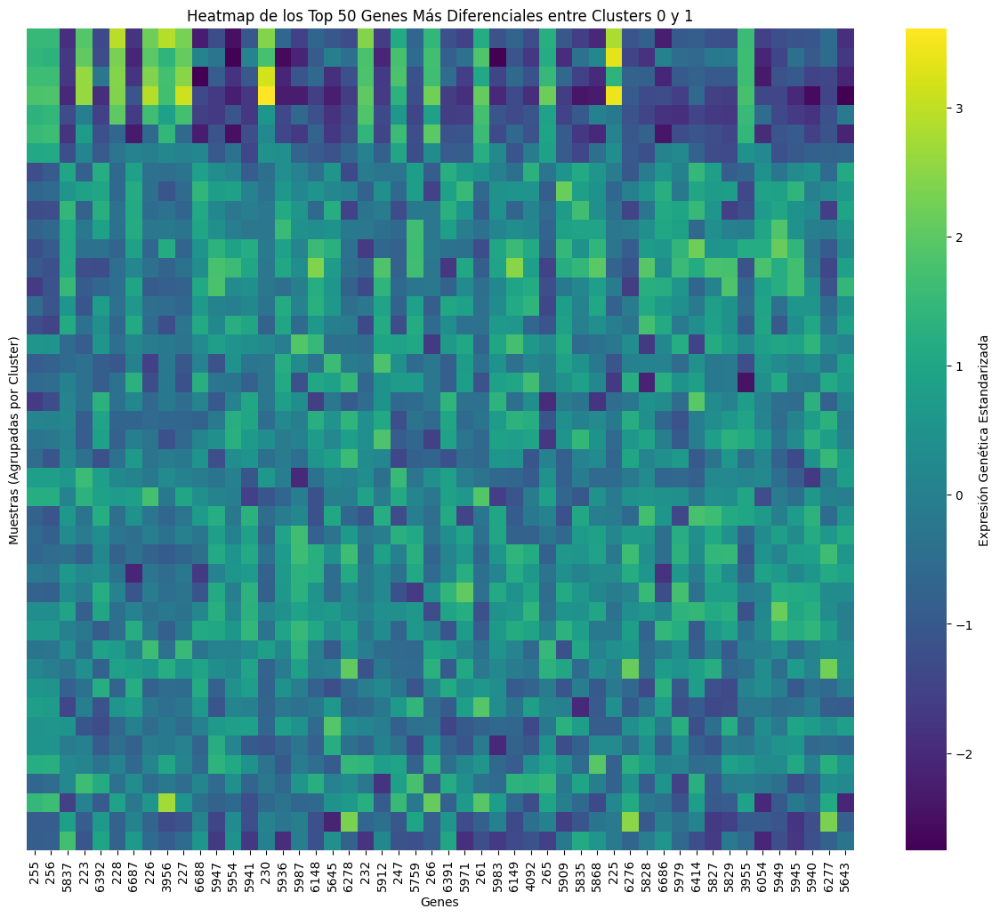

# Paso 8 — K-Means con K=7 y Heatmap de Genes Diferenciales

## Aplicar K-Means con el K óptimo

Con K=7 identificado como el número óptimo de clusters, lo aplicamos al dataset NCI60 completo:

```python
from sklearn.cluster import KMeans

# K-Means con 7 clusters sobre los datos originales (6830 genes)
kmeans_optimal = KMeans(n_clusters=7, n_init=10, random_state=42)
kmeans_optimal.fit(X_nci60)

# Agregar etiquetas al DataFrame de PCA para visualizar
df_nci60_pca['Cluster_KMeans_K7'] = kmeans_optimal.labels_

# Proyectar centroides al espacio PCA
centroids_pca_space_k7 = pca.transform(kmeans_optimal.cluster_centers_)

print("K-Means con K=7 completado.")
display(df_nci60_pca.head())
```

---

## Visualización: K=7 en PC1 vs PC2

```python
plt.figure(figsize=(10, 7))
sns.scatterplot(
    x='Principal Component 1',
    y='Principal Component 2',
    data=df_nci60_pca,
    hue='Cluster_KMeans_K7',
    palette='viridis',
    s=50, alpha=0.8
)

plt.scatter(
    centroids_pca_space_k7[:, 0], centroids_pca_space_k7[:, 1],
    marker='X', s=200, color='red', edgecolor='black', label='Centroides'
)

plt.title('Clusters K-Means del Dataset NCI60 (K=7, PC1 vs PC2)')
plt.xlabel('Principal Component 1')
plt.ylabel('Principal Component 2')
plt.grid(True, linestyle='--', alpha=0.6)
plt.legend(title='Cluster')
plt.show()
```



---

## Heatmap de genes diferenciales

Una vez que tenemos clusters bien definidos, una pregunta natural es: **¿qué genes distinguen a un cluster de otro?** El heatmap nos ayuda a responder eso visualmente.

### Seleccionar dos clusters y los genes más diferentes entre ellos

```python
from sklearn.preprocessing import StandardScaler

# Seleccionamos los clusters 0 y 1 para comparar
selected_clusters = [0, 1]

# Crear DataFrame combinado con etiquetas de cluster
df_combined = X_nci60.copy()
df_combined['Cluster'] = kmeans_optimal.labels_

# Filtrar solo los clusters seleccionados
df_filtered = df_combined[df_combined['Cluster'].isin(selected_clusters)]
X_filtered = df_filtered.drop(columns=['Cluster'])
y_filtered = df_filtered['Cluster']

# Calcular expresión promedio de cada gen por cluster
average_expression = df_filtered.groupby('Cluster').mean()

# Diferencia absoluta entre los dos clusters para cada gen
diff_expression = (
    average_expression.loc[selected_clusters[0]] -
    average_expression.loc[selected_clusters[1]]
).abs()

# Los 50 genes con mayor diferencia entre los dos clusters
top_genes = diff_expression.nlargest(50).index

print(f"Top 50 genes más diferenciales entre cluster {selected_clusters[0]} y {selected_clusters[1]}:")
display(top_genes)
```

**¿Qué hace este código?**

1. Filtra los datos para quedarse solo con las muestras de los clusters 0 y 1.
2. Calcula el promedio de expresión de cada gen dentro de cada cluster.
3. Calcula cuánto difiere el promedio entre ambos clusters (diferencia absoluta).
4. Selecciona los 50 genes con mayor diferencia: estos son los más "informativos" para distinguir entre los dos grupos.

---

### Estandarizar y graficar el heatmap

```python
# Quedarnos solo con los top 50 genes
X_top_genes = X_filtered[top_genes]

# Estandarizar: media 0, desviación estándar 1 por gen
scaler = StandardScaler()
X_scaled = scaler.fit_transform(X_top_genes)
X_scaled_df = pd.DataFrame(X_scaled, columns=top_genes, index=X_top_genes.index)

# Agregar columna de cluster y ordenar por ella
X_scaled_df['Cluster'] = y_filtered.values
X_scaled_df = X_scaled_df.sort_values(by='Cluster').reset_index(drop=True)

# Remover la columna de cluster antes de graficar
X_heatmap = X_scaled_df.drop(columns=['Cluster'])

# Graficar
plt.figure(figsize=(15, 12))
sns.heatmap(
    X_heatmap,
    cmap='viridis',
    yticklabels=False,
    cbar_kws={'label': 'Expresión Genética Estandarizada'}
)
plt.title(f'Top 50 Genes Más Diferenciales — Clusters {selected_clusters[0]} vs {selected_clusters[1]}')
plt.xlabel('Genes')
plt.ylabel('Muestras (ordenadas por cluster)')
plt.show()
```



---

## ¿Por qué estandarizar?

Los genes tienen rangos de expresión muy diferentes entre sí. Sin estandarización, los genes con valores absolutos mayores dominarían visualmente el heatmap. Al estandarizar (restar la media y dividir por la desviación estándar), todos los genes quedan en la misma escala y las diferencias de patrón son comparables.

---

## Conclusión del tutorial de K-Means

A lo largo de este tutorial hemos:

1. **Construido K-Means desde cero** en un dataset sintético, paso a paso, para entender la lógica interna del algoritmo.
2. **Aplicado K-Means a datos reales** de expresión genética de alta dimensionalidad (NCI60).
3. **Usado PCA** para visualizar datos que originalmente tienen 6,830 dimensiones.
4. **Encontrado el K óptimo** usando el Método del Codo y el Coeficiente de Silueta.
5. **Analizado los genes más diferenciales** entre clusters mediante un heatmap.

K-Means es un punto de entrada excelente al mundo del clustering no supervisado. En el siguiente tutorial exploraremos **Hierarchical Clustering**, que no requiere especificar K de antemano y produce una representación jerárquica de las relaciones entre los datos.

---

*← [K óptimo: Elbow & Silhouette](07_k_optimo.md)*
